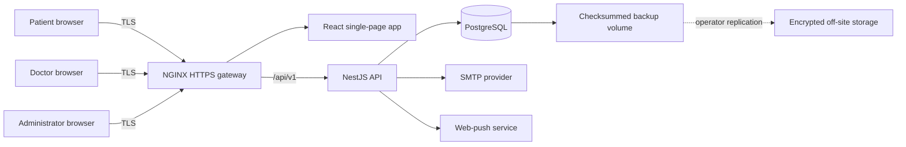
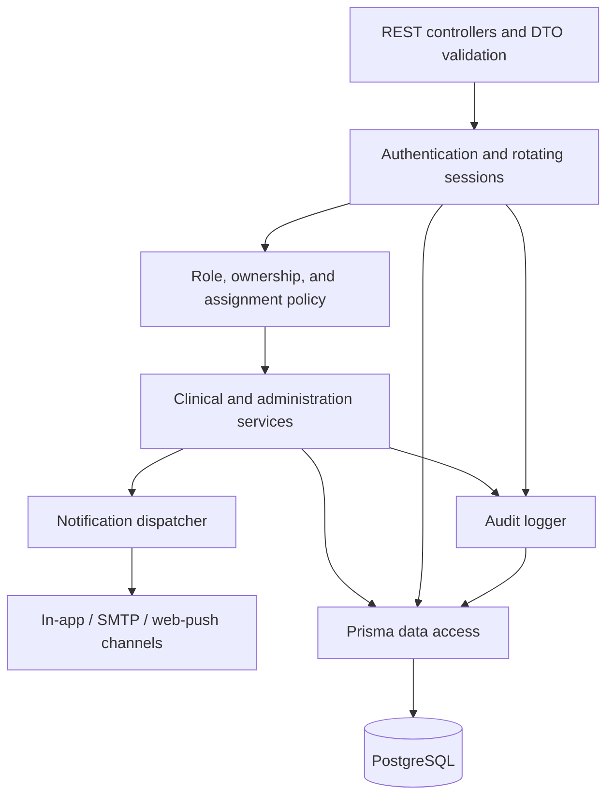
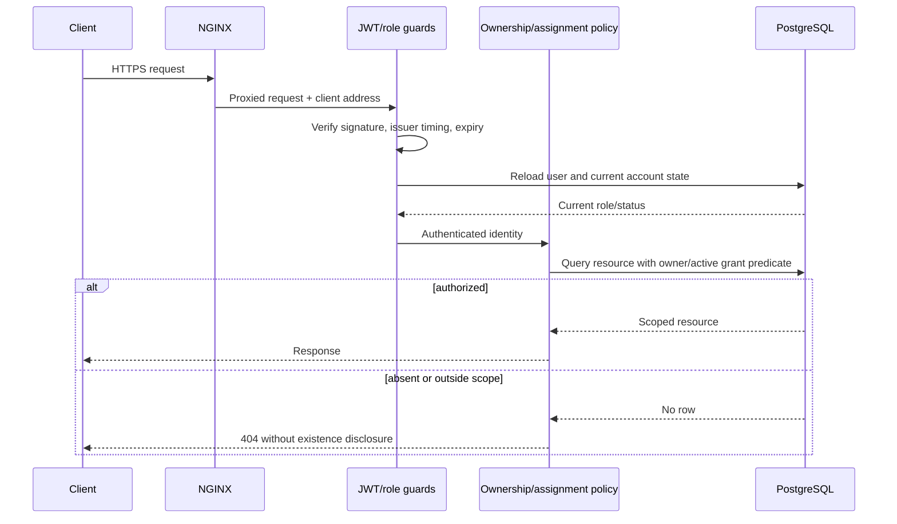
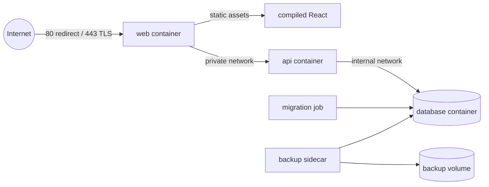

# Architecture

## System context

NGINX is the only public container. PostgreSQL is restricted to an internal
Docker network. The API trusts one proxy hop only when `TRUST_PROXY=true`, so
application rate limiting uses the original client address supplied by the
managed gateway.

## Backend components

Controllers accept identity-neutral DTOs: a patient never chooses the
`patientId` for a patient-owned resource. Services derive it from the
authenticated user. Doctor queries require an active `DoctorPatientAccess`
row in the same database predicate as the requested patient. An appointment
does not implicitly grant clinical access.

## Authorization request flow

## Data ownership invariants

| Actor   | Clinical scope                                                                             | Assignment management | Account management                        |
| ------- | ------------------------------------------------------------------------------------------ | --------------------- | ----------------------------------------- |
| Patient | Own profile and records                                                                    | None                  | Own authentication sessions               |
| Doctor  | Patients with an active explicit grant                                                     | None                  | Own authentication sessions               |
| Admin   | Operational/account metadata; clinical access only where an endpoint explicitly permits it | Grant/revoke          | Users, doctors, roles, status, audit logs |

These invariants must be enforced in database `where` clauses, not by loading a
row first and comparing identifiers afterward. Deactivated users and revoked
assignments stop authorizing new requests immediately because the server
reloads current state.

## Deployment topology

Database migrations run as a one-shot dependency before the API becomes
healthy. Deployments should be rolling or performed during a maintenance
window when a migration is not backward compatible.
