# CareTrack Medical Tracking Platform

## Final project report

| Report field            | Value                                       |
| ----------------------- | ------------------------------------------- |
| Student                 | **[Insert student name and identifier]**    |
| Programme / course      | **[Insert programme and course]**           |
| University              | **[Insert university]**                     |
| Supervisor              | **[Insert supervisor]**                     |
| Submission date         | **[Insert submission date]**                |
| Implementation baseline | Repository state verified on 14 August 2026 |

> The bracketed student and institution fields must be completed by the author
> before formal submission. Fifteen genuine UI screenshots were captured from
> the application using synthetic data; the register separately identifies
> optional views that remain pending. No demonstration image was fabricated.

## Abstract

CareTrack is a full-stack medical tracking system for patients, their
explicitly assigned doctors, and administrators. It consolidates medication
schedules and adherence, measurements and wearable observations, threshold
alerts, appointments, emergency information, longitudinal records, goals,
notifications, and exportable health reports. The central security rule is
that authentication alone never grants clinical access: the API derives the
patient or doctor identity from the validated session, checks the caller's
current database role and account status, and requires an active doctor-patient
assignment for a doctor's patient-specific request.

The implementation uses React and TypeScript in the browser, NestJS and Prisma
in the API, and PostgreSQL for durable data. Advanced authentication includes
short-lived JSON Web Tokens (JWTs), rotating hashed refresh sessions, password
recovery, email verification, password changes, session revocation, and
rate-limited public endpoints. Notifications are persisted before optional
SMTP and Web Push delivery. Production assets include multi-stage container
images, one-shot database migration, an NGINX HTTPS boundary, environment-only
secrets, scheduled checksummed backups, and a destructive-test-safe fresh
database restore verifier.

Automated verification covers unit, integration/end-to-end, validation, and
adversarial security behavior. In particular, it exercises expired and
modified JWTs, database-backed role changes, horizontal access attempts,
unassigned-doctor access, malicious ownership fields, malformed input, and
actual throttling. This report documents the requirements, design, data model,
security controls, verification evidence, deployment procedure, limitations,
and future work.

## 1. Problem statement and motivation

Home health information is commonly fragmented across paper medication plans,
device applications, isolated measurements, appointment calendars, and
informal communication with clinicians. Fragmentation creates practical risks:
missed doses can go unnoticed, abnormal trends may not be surfaced promptly,
appointments can be lost, and clinicians may receive incomplete histories.
At the same time, placing all records in one system creates a serious privacy
obligation. A convenient clinical dashboard is not acceptable if one patient
can read another patient's record or if every doctor can browse every patient.

CareTrack addresses both sides of the problem. It provides one patient-centred
record and actionable reminders, while making ownership and assignment checks
part of the server-side data query. Administrative functions are separated
from clinical functions and recorded in an audit trail. The project is an
educational platform, not a certified medical device, diagnostic engine, or a
substitute for emergency services.

## 2. Objectives and success criteria

The project objectives were:

1. Deliver complete appointment scheduling and management for patients,
   doctors, and administrators.
2. Introduce explicit, revocable doctor-patient assignments and enforce them
   for every patient-specific doctor request.
3. Replace dashboard placeholders with live assigned-patient, alert,
   medication, measurement, and appointment information.
4. Provide administrator management of users, doctors, roles, account status,
   assignments, and audit logs.
5. Generate medication reminders and overdue-dose notifications idempotently.
6. Support real SMTP email and Web Push providers without committing secrets.
7. Add rotating refresh sessions, password recovery, email verification,
   password change, and session management.
8. Demonstrate resistance to token tampering, privilege escalation,
   cross-patient access, unassigned-doctor access, malformed data, and abusive
   request rates.
9. Deliver usable OpenAPI documentation, design diagrams, operational
   documentation, HTTPS deployment, tested backup/restore, and a final security
   review.

Success means that authorization is enforced in the API rather than trusted to
the UI; invalid transitions fail predictably; scheduled work is safe to repeat;
provider failures do not lose in-app state; production configuration can be
validated without exposing secrets; and the critical controls have automated
tests.

## 3. Scope, actors, and assumptions

### 3.1 Actors

- **Patient:** manages only their own profile, care data, devices,
  appointments, notifications, goals, emergency information, and reports.
- **Doctor:** views operational summaries and clinical records only for
  patients with an active assignment; creates notes and immutable follow-ups
  within that scope.
- **Administrator:** manages accounts, roles, statuses, and assignments, and
  reviews audit history. Administrator status does not silently turn an admin
  endpoint into an unrestricted patient-clinical endpoint.
- **Scheduler:** evaluates medication doses, appointment reminder windows, and
  pending deliveries at repeatable intervals.
- **External providers:** an SMTP server and standards-compliant Web Push
  endpoints deliver optional notifications.
- **Operator:** deploys reviewed images, injects secrets, monitors the service,
  manages certificates, and verifies backups.

### 3.2 Scope boundaries

The system stores and reports observations but does not diagnose disease,
recommend treatment, contact public emergency services, integrate with an
electronic health-record network, or guarantee delivery by third-party email
and push networks. Wearable integrations other than the deterministic mock
adapter require provider-specific consent and API work. Legal compliance
depends on the organization, jurisdiction, hosting controls, retention policy,
and operating procedures; source code alone cannot establish compliance.

## 4. Requirements and traceability

### 4.1 Functional requirements

| ID    | Requirement                                                                                                       | Implementation evidence                                                    | Verification evidence                                      |
| ----- | ----------------------------------------------------------------------------------------------------------------- | -------------------------------------------------------------------------- | ---------------------------------------------------------- |
| FR-01 | A visitor can register only as a patient and authenticate without choosing a privileged role.                     | `auth` controller/service; registration DTO whitelist                      | DTO, auth unit, and privilege-escalation E2E tests         |
| FR-02 | A session uses a short-lived access token and a rotating, revocable refresh token.                                | `AuthSession`; hashed tokens; HttpOnly refresh cookie                      | advanced-auth unit tests and cookie-route E2E tests        |
| FR-03 | Users can recover a password, verify email, change password, list sessions, and revoke one or all sessions.       | `OneTimeToken`, auth session endpoints, non-enumerating recovery           | auth unit/validation tests and owned-session security E2E  |
| FR-04 | A patient can manage their own profile, medications, measurements, devices, metrics, rules, alerts, and contacts. | patient clinical modules with identity-derived predicates                  | service tests, DTO tests, cross-patient E2E                |
| FR-05 | Patients, doctors, and admins can list and manage appointments within role-specific rules.                        | `appointments` module and collision indexes/checks                         | appointment service tests and scoped-object E2E            |
| FR-06 | An administrator can create, reactivate, list, and revoke doctor-patient assignments.                             | `DoctorPatientAccess`; admin assignment endpoints                          | admin service tests and admin route-boundary E2E           |
| FR-07 | A doctor sees only actively assigned patients and their permitted clinical data.                                  | central clinical-access service; doctor and reporting queries              | unassigned-doctor unit/E2E tests and doctor role matrix    |
| FR-08 | Doctor and admin dashboards contain database-backed operational information.                                      | doctor/admin dashboard services and React dashboards                       | service tests, API E2E, production UI build                |
| FR-09 | Dose logs produce deduplicated reminders and overdue notifications.                                               | medication reminder scheduler; unique schedule/date and notification keys  | reminder unit tests, uniqueness constraints                |
| FR-10 | Upcoming appointments can produce preference-aware reminders.                                                     | appointment reminder scheduler and preferences                             | reminder/service tests                                     |
| FR-11 | Users can read notification state and manage personal delivery preferences/subscriptions.                         | notifications controller; `NotificationPreference`; `PushSubscription`     | service tests and cross-user notification/subscription E2E |
| FR-12 | Notifications persist in-app and optionally dispatch by email and Web Push.                                       | channel abstraction, SMTP provider, Web Push provider, delivery ledger     | provider/service tests; production environment validation  |
| FR-13 | Patients have medical-history, goal, emergency-event, health-report, and export functions.                        | clinical-records, medical-history, health-goals, emergency-events, reports | module tests, route authorization tests, build validation  |
| FR-14 | Administrative and security-relevant actions are auditable.                                                       | `AuditLog` and health-audit service                                        | audit service and admin service tests                      |
| FR-15 | Consumers can discover request/response/authentication contracts interactively.                                   | generated OpenAPI JSON and Swagger UI                                      | OpenAPI contract assertions in E2E tests                   |
| FR-16 | Operators can deploy, migrate, back up, restore, and verify the database.                                         | Docker/NGINX assets, backup scripts, fresh restore verifier                | Compose/env checks and recorded PostgreSQL restore drill   |

### 4.2 Non-functional requirements

| ID     | Quality requirement     | Measurable acceptance condition                                                                                                         |
| ------ | ----------------------- | --------------------------------------------------------------------------------------------------------------------------------------- |
| NFR-01 | Confidentiality         | TLS at the public boundary; secrets and refresh tokens never exposed to browser JavaScript, source control, or normal logs.             |
| NFR-02 | Authorization           | Current database role/status and resource ownership/assignment are checked; out-of-scope resources normally return `404`.               |
| NFR-03 | Input integrity         | DTO validation transforms approved fields and rejects missing, invalid, out-of-range, and unknown properties.                           |
| NFR-04 | Abuse resistance        | Default 120 requests/minute plus tighter authentication endpoint limits; automated tests observe `429`.                                 |
| NFR-05 | Reliability             | Scheduled notifications are deduplicated; delivery attempts have explicit states; database migrations gate API startup.                 |
| NFR-06 | Recoverability          | Backups have SHA-256 checksums and retention; a fresh restore drill compares schema, rows, content, and sequence state.                 |
| NFR-07 | Maintainability         | TypeScript modules, shared access policy, Prisma migrations, linting, automated tests, and generated API contracts.                     |
| NFR-08 | Portability             | Reproducible multi-stage images and Compose topology; local development remains supported on Node.js and PostgreSQL.                    |
| NFR-09 | Observability           | Health checks, structured application events, notification delivery state, and immutable audit records without patient payload logging. |
| NFR-10 | Accessibility/usability | Responsive role-specific pages, explicit loading/error/empty states, semantic form controls, and keyboard-visible interactions.         |

## 5. System design

### 5.1 Technology choices

| Layer          | Technology                                  | Rationale                                                                              |
| -------------- | ------------------------------------------- | -------------------------------------------------------------------------------------- |
| Web client     | React, TypeScript, Vite                     | Typed component model and small production bundle                                      |
| API            | NestJS, TypeScript                          | Modules, dependency injection, guards, validation, scheduling, and OpenAPI integration |
| Persistence    | PostgreSQL 17, Prisma                       | Relational integrity, migrations, transactional operations, generated types            |
| Authentication | Passport JWT, bcrypt, opaque refresh tokens | Short-lived request identity plus server-revocable sessions                            |
| Notifications  | Nodemailer/SMTP, Web Push, in-app ledger    | Provider portability and delivery-state visibility                                     |
| Edge           | NGINX                                       | TLS termination, HTTP redirect, static SPA hosting, proxy limits and headers           |
| Packaging      | Docker Compose, multi-stage images          | Reviewable build/deploy topology with migration gating                                 |
| Verification   | Jest, Supertest, ESLint, npm audit          | Unit, endpoint, adversarial, static, and dependency checks                             |

### 5.2 System context

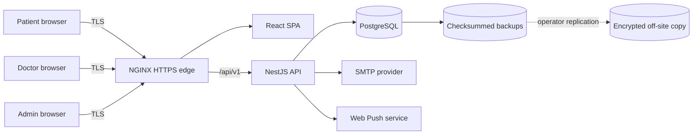
```mermaid
flowchart LR
    P[Patient browser]
    D[Doctor browser]
    A[Admin browser]
    E[NGINX HTTPS edge]
    W[React SPA]
    API[NestJS API]
    DB[(PostgreSQL)]
    MAIL[SMTP provider]
    PUSH[Web Push service]
    BK[(Checksummed backups)]
    OFF[(Encrypted off-site copy)]

    P -->|TLS| E
    D -->|TLS| E
    A -->|TLS| E
    E --> W
    E -->|/api/v1| API
    API --> DB
    API --> MAIL
    API --> PUSH
    DB --> BK
    BK -. operator replication .-> OFF
```

Only NGINX publishes host ports. The API and database communicate over an
internal network; PostgreSQL has no public host mapping. The API trusts exactly
one proxy hop only when explicitly configured.

### 5.3 Backend component design

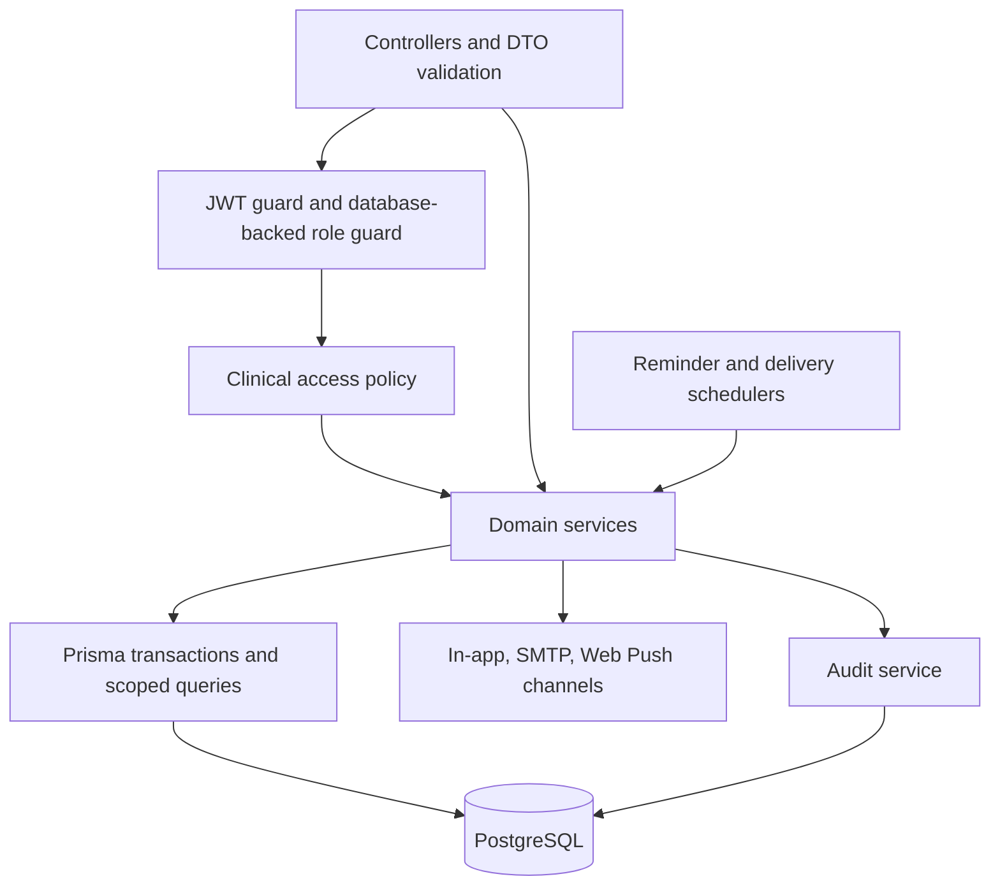
```mermaid
flowchart TB
    HTTP[Controllers and DTO validation]
    AUTH[JWT guard and database-backed role guard]
    ACCESS[Clinical access policy]
    DOMAIN[Domain services]
    JOBS[Reminder and delivery schedulers]
    ORM[Prisma transactions and scoped queries]
    PG[(PostgreSQL)]
    CHANNELS[In-app, SMTP, Web Push channels]
    AUDIT[Audit service]

    HTTP --> AUTH
    AUTH --> ACCESS
    ACCESS --> DOMAIN
    HTTP --> DOMAIN
    JOBS --> DOMAIN
    DOMAIN --> ORM
    ORM --> PG
    DOMAIN --> CHANNELS
    DOMAIN --> AUDIT
    AUDIT --> PG
```

The controller guard rejects absent identity and incorrect roles. The service
layer then applies object-level policy in the same query as the data lookup.
This layered design prevents a future caller from bypassing policy merely by
calling a service method with a patient identifier supplied by a client.

### 5.4 Data model (ERD)

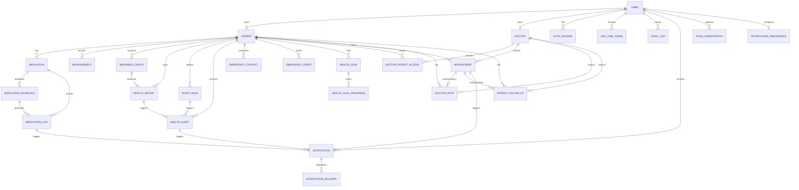
```mermaid
erDiagram
    USER ||--o| PATIENT : owns
    USER ||--o| DOCTOR : owns
    USER ||--o{ AUTH_SESSION : has
    USER ||--o{ ONE_TIME_TOKEN : receives
    USER ||--o{ AUDIT_LOG : causes
    USER ||--o{ NOTIFICATION : receives
    USER ||--o{ PUSH_SUBSCRIPTION : registers
    USER ||--o| NOTIFICATION_PREFERENCE : configures

    PATIENT ||--o{ MEDICATION : has
    MEDICATION ||--o{ MEDICATION_SCHEDULE : schedules
    MEDICATION ||--o{ MEDICATION_LOG : records
    MEDICATION_SCHEDULE ||--o{ MEDICATION_LOG : generates
    MEDICATION_LOG ||--o{ NOTIFICATION : triggers

    PATIENT ||--o{ MEASUREMENT : records
    PATIENT ||--o{ WEARABLE_DEVICE : connects
    PATIENT ||--o{ HEALTH_METRIC : owns
    WEARABLE_DEVICE ||--o{ HEALTH_METRIC : produces
    PATIENT ||--o{ ALERT_RULE : defines
    PATIENT ||--o{ HEALTH_ALERT : receives
    ALERT_RULE ||--o{ HEALTH_ALERT : triggers
    HEALTH_METRIC ||--o{ HEALTH_ALERT : triggers
    HEALTH_ALERT ||--o{ NOTIFICATION : triggers

    PATIENT ||--o{ EMERGENCY_CONTACT : nominates
    PATIENT ||--o{ EMERGENCY_EVENT : raises
    PATIENT ||--o{ HEALTH_GOAL : sets
    HEALTH_GOAL ||--o{ HEALTH_GOAL_PROGRESS : tracks

    DOCTOR ||--o{ DOCTOR_PATIENT_ACCESS : receives
    PATIENT ||--o{ DOCTOR_PATIENT_ACCESS : grants
    PATIENT ||--o{ APPOINTMENT : books
    DOCTOR ||--o{ APPOINTMENT : attends
    PATIENT ||--o{ DOCTOR_NOTE : has
    DOCTOR ||--o{ DOCTOR_NOTE : authors
    APPOINTMENT ||--o{ DOCTOR_NOTE : contextualizes
    PATIENT ||--o{ PATIENT_FOLLOW_UP : has
    DOCTOR ||--o{ PATIENT_FOLLOW_UP : authors
    APPOINTMENT ||--o{ PATIENT_FOLLOW_UP : contextualizes
    APPOINTMENT ||--o{ NOTIFICATION : triggers

    NOTIFICATION ||--o{ NOTIFICATION_DELIVERY : dispatches
```

Important invariants are implemented as database constraints as well as
application rules: unique user email, unique doctor license where supplied,
one role profile per user, one doctor-patient grant per pair, one dose log per
schedule/date, unique health-metric deduplication keys, unique
notification/channel deliveries, and unique notification deduplication keys.
The canonical field-level schema is `backend/prisma/schema.prisma`; changes are
versioned under `backend/prisma/migrations`.

## 6. Use cases and authorization

### 6.1 Use-case overview

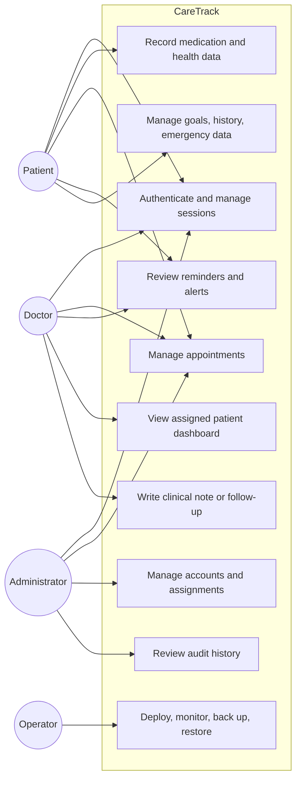
```mermaid
flowchart LR
    PAT((Patient))
    DOC((Doctor))
    ADM((Administrator))
    OPS((Operator))

    subgraph CareTrack
      UC1[Authenticate and manage sessions]
      UC2[Record medication and health data]
      UC3[Manage appointments]
      UC4[Review reminders and alerts]
      UC5[Manage goals, history, emergency data]
      UC6[View assigned patient dashboard]
      UC7[Write clinical note or follow-up]
      UC8[Manage accounts and assignments]
      UC9[Review audit history]
      UC10[Deploy, monitor, back up, restore]
    end

    PAT --> UC1
    PAT --> UC2
    PAT --> UC3
    PAT --> UC4
    PAT --> UC5
    DOC --> UC1
    DOC --> UC3
    DOC --> UC4
    DOC --> UC6
    DOC --> UC7
    ADM --> UC1
    ADM --> UC3
    ADM --> UC8
    ADM --> UC9
    OPS --> UC10
```

### 6.2 Role/access matrix

| Capability                                     |         Patient |                        Assigned doctor |                 Unassigned doctor |                                 Administrator |
| ---------------------------------------------- | --------------: | -------------------------------------: | --------------------------------: | --------------------------------------------: |
| Own profile and clinical records               |          Manage |                  Read permitted record |                              None |                   No implicit clinical access |
| Medication/measurement/device ownership routes |      Manage own | Dashboard/read through assigned routes |                              None |                                          None |
| Appointments                                   |   Scoped manage |                          Scoped manage | Own schedule only where permitted |       Manage all through explicit admin rules |
| Doctor notes/follow-ups                        |        Read own |  Create/read assigned; update own note |                              None |                                          None |
| Goals/history/reports                          | Manage/read own |                   Read assigned subset |                              None | Export only where endpoint explicitly permits |
| Notifications/sessions                         |        Own only |                               Own only |                          Own only |                                      Own only |
| Account and assignment administration          |            None |                                   None |                              None |                              Manage and audit |

### 6.3 Doctor assignment authorization sequence

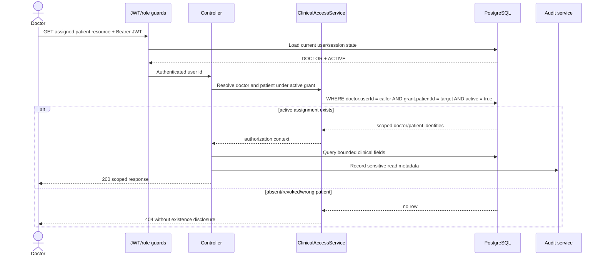
```mermaid
sequenceDiagram
    actor D as Doctor
    participant G as JWT/role guards
    participant C as Controller
    participant X as ClinicalAccessService
    participant DB as PostgreSQL
    participant AU as Audit service

    D->>G: GET assigned patient resource + Bearer JWT
    G->>DB: Load current user/session state
    DB-->>G: DOCTOR + ACTIVE
    G->>C: Authenticated user id
    C->>X: Resolve doctor and patient under active grant
    X->>DB: WHERE doctor.userId = caller AND grant.patientId = target AND active = true
    alt active assignment exists
      DB-->>X: scoped doctor/patient identities
      X-->>C: authorization context
      C->>DB: Query bounded clinical fields
      C->>AU: Record sensitive read metadata
      C-->>D: 200 scoped response
    else absent/revoked/wrong patient
      DB-->>X: no row
      X-->>D: 404 without existence disclosure
    end
```

### 6.4 Refresh-token rotation sequence

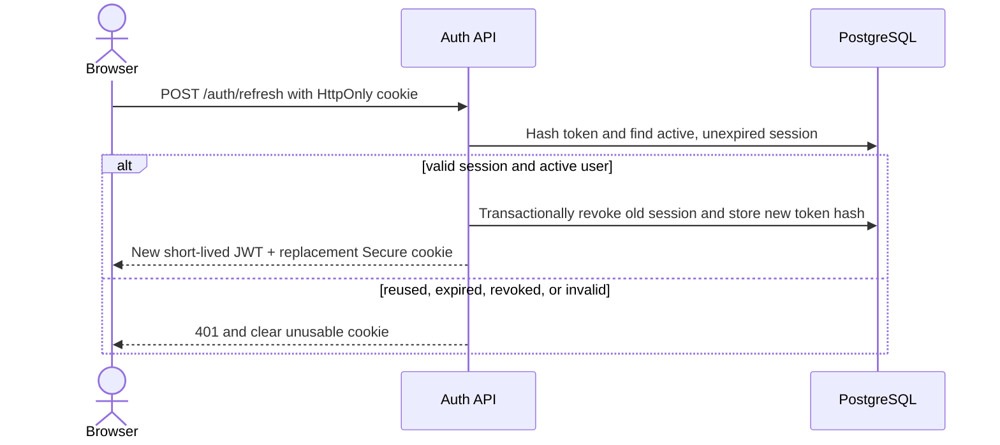
```mermaid
sequenceDiagram
    actor B as Browser
    participant A as Auth API
    participant DB as PostgreSQL

    B->>A: POST /auth/refresh with HttpOnly cookie
    A->>DB: Hash token and find active, unexpired session
    alt valid session and active user
      A->>DB: Transactionally revoke old session and store new token hash
      A-->>B: New short-lived JWT + replacement Secure cookie
    else reused, expired, revoked, or invalid
      A-->>B: 401 and clear unusable cookie
    end
```

### 6.5 Appointment scheduling sequence

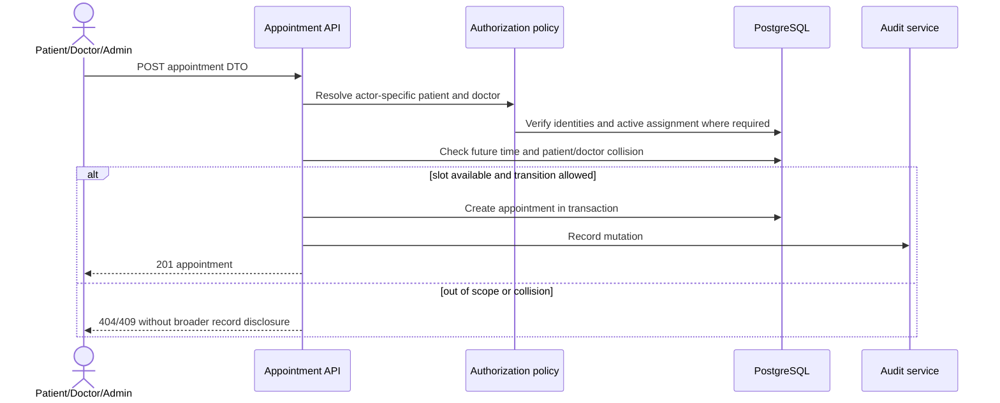
```mermaid
sequenceDiagram
    actor U as Patient/Doctor/Admin
    participant API as Appointment API
    participant P as Authorization policy
    participant DB as PostgreSQL
    participant AU as Audit service

    U->>API: POST appointment DTO
    API->>P: Resolve actor-specific patient and doctor
    P->>DB: Verify identities and active assignment where required
    API->>DB: Check future time and patient/doctor collision
    alt slot available and transition allowed
      API->>DB: Create appointment in transaction
      API->>AU: Record mutation
      API-->>U: 201 appointment
    else out of scope or collision
      API-->>U: 404/409 without broader record disclosure
    end
```

### 6.6 Measurement-to-notification sequence

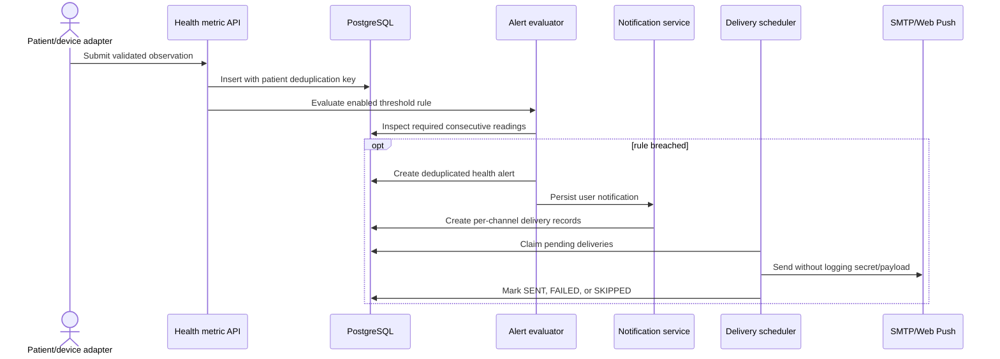
```mermaid
sequenceDiagram
    actor P as Patient/device adapter
    participant API as Health metric API
    participant DB as PostgreSQL
    participant EV as Alert evaluator
    participant N as Notification service
    participant Q as Delivery scheduler
    participant EXT as SMTP/Web Push

    P->>API: Submit validated observation
    API->>DB: Insert with patient deduplication key
    API->>EV: Evaluate enabled threshold rule
    EV->>DB: Inspect required consecutive readings
    opt rule breached
      EV->>DB: Create deduplicated health alert
      EV->>N: Persist user notification
      N->>DB: Create per-channel delivery records
      Q->>DB: Claim pending deliveries
      Q->>EXT: Send without logging secret/payload
      Q->>DB: Mark SENT, FAILED, or SKIPPED
    end
```

## 7. Security engineering

### 7.1 Assets and trust boundaries

High-value assets are account credentials, session tokens, personally
identifiable and clinical data, notification endpoints, audit evidence,
database backups, provider credentials, and TLS keys. Trust boundaries exist
between the browser and NGINX, NGINX and API, API and PostgreSQL, API and
third-party providers, operators and the deployment host, and the live
database and backup storage.

### 7.2 Principal threats and controls

| Threat                                             | Primary controls                                                                             | Verification                                                                |
| -------------------------------------------------- | -------------------------------------------------------------------------------------------- | --------------------------------------------------------------------------- |
| Stolen long-lived bearer token                     | 15-minute access token; rotating server-side refresh session; revocation                     | expired JWT and session tests                                               |
| JWT modification or algorithm misuse               | signed-token verification with configured secret/issuer/audience                             | tampered-token E2E                                                          |
| Privilege escalation in registration/token claims  | registration role omitted; current role/status loaded from DB                                | mass-assignment and stale-role E2E                                          |
| Horizontal patient access (IDOR)                   | user-to-patient derivation and ownership predicate in query                                  | foreign measurement/appointment/notification E2E                            |
| Doctor browses unassigned record                   | active assignment predicate in central policy                                                | unassigned-doctor tests                                                     |
| Disabled/deleted account continues using JWT       | database-backed authentication on every protected request                                    | deleted/status-changed-user tests                                           |
| Brute-force or request flooding                    | route-specific throttles, global throttle, NGINX request limiting                            | login and global real-throttle E2E                                          |
| Malformed or over-posted data                      | class validation, whitelist, unknown-field rejection, database constraints                   | malformed payload matrix                                                    |
| Password/reset-token disclosure                    | bcrypt passwords; hashed one-time tokens; generic recovery response; short TTL               | auth unit and endpoint tests                                                |
| Refresh-token theft by script                      | `HttpOnly`, `SameSite=Strict`, path-limited, production `Secure` cookie                      | OpenAPI/config review and auth tests                                        |
| Notification provider compromise/failure           | environment-only credentials, HTTPS push allowlist, bounded delivery ledger, redacted errors | provider tests and environment verifier                                     |
| Sensitive data in logs                             | explicit audit metadata; no request-body/token logging; documented redaction list            | source/config review                                                        |
| Backup corruption or silent incomplete restore     | custom-format dump, SHA-256, fresh target, schema/content/sequence comparison                | recorded PostgreSQL restore drill                                           |
| Transport downgrade/clickjacking/content injection | HTTP-to-HTTPS redirect, TLS 1.2/1.3, HSTS, CSP, frame denial, Helmet                         | NGINX/app configuration review; external TLS scan required after deployment |

### 7.3 Authentication and credential handling

Passwords are hashed with bcrypt and never returned. Access tokens contain
identity claims but are not treated as durable authorization facts; the guard
loads the user and checks the current role/status. Refresh and one-time tokens
are random opaque values whose hashes are stored. Password reset consumes its
token and revokes existing sessions. Email recovery/resend responses are
non-enumerating. Session management is scoped by both session ID and caller
user ID.

All production secrets are required through environment variables and are
validated before service start. The committed production example contains
placeholders only. `.gitignore` excludes real environments, certificates,
backups, and generated evidence. SMTP password, Web Push private key, JWT
secret, database credential, and TLS private key must be sourced from the
deployment platform's secret manager.

### 7.4 Privacy and audit design

The API returns bounded role-specific response shapes. Ownership identifiers
are derived rather than trusted. `404` is used for most out-of-scope object
lookups to avoid confirming that a record exists. Security and administrative
events record actor/action/entity metadata, not passwords, JWTs, cookies,
provider secrets, or complete clinical payloads. Audit access itself is
administrator-only. Production retention, access review, data-subject request,
and breach-response procedures remain organizational responsibilities.

### 7.5 Residual security work before a real clinical launch

- Commission an independent penetration test and threat-model review.
- Use a managed key/secret service, centralized tamper-resistant logs, alerting,
  malware/image scanning, and automated secret scanning in CI.
- Decide jurisdiction-specific consent, retention, deletion, residency,
  incident response, and business-associate/vendor requirements.
- Add multi-factor authentication for doctors, administrators, and operators.
- Run an external TLS/header scan against the deployed hostname and repeat it
  after edge configuration changes.

## 8. Verification and quality assurance

### 8.1 Test strategy

The project uses four complementary levels:

1. **Unit tests** exercise service rules, transactions, role transitions,
   schedulers, provider behavior, and DTO boundary logic with controlled
   dependencies.
2. **API end-to-end tests** instantiate the Nest application with the same
   global prefix, validation, guards, and throttling used at runtime.
3. **Adversarial security E2E tests** deliberately send forged/expired tokens,
   cross-user identifiers, unauthorized roles, unknown fields, malformed
   values, and burst traffic.
4. **Static and operational checks** compile both applications, lint source,
   audit production dependencies, validate Prisma and Compose, verify required
   production environment values, and restore a real PostgreSQL backup.

### 8.2 Cybersecurity coverage matrix

| Security property               | Test stimulus                                                  | Expected result                              |
| ------------------------------- | -------------------------------------------------------------- | -------------------------------------------- |
| Missing authentication          | protected endpoints without a token                            | `401`                                        |
| Expired access token            | correctly signed token with past expiry                        | `401`                                        |
| Modified access token           | alter a signed JWT segment                                     | `401`                                        |
| Stale elevated claim            | token claims admin/doctor while DB says patient                | `403`                                        |
| Removed account                 | valid token whose user no longer exists                        | `401`                                        |
| Cross-patient ownership         | patient A requests patient B object identifier                 | `404`; query includes A's patient/user scope |
| Cross-user notification/session | user A mutates B's object identifier                           | no B mutation; owned predicate required      |
| Unassigned doctor               | doctor requests a patient without active grant                 | `404`                                        |
| Patient on doctor/admin API     | valid patient token across route matrix                        | `403`                                        |
| Ownership mass assignment       | payload includes server-owned `patientId`, `userId`, or `role` | `400`                                        |
| Malformed fields                | invalid UUID/date/URL/pagination/range/unknown field           | `400`                                        |
| Login abuse                     | exceed endpoint-specific limit                                 | `429`                                        |
| Generic API abuse               | exceed default 120/minute limit                                | `429`                                        |

The dedicated security suite contains 101 passing endpoint cases;
the final command record is maintained alongside the backup evidence in the
repository documentation. The suite uses controlled Prisma mocks to assert the
exact scope predicate as well as the HTTP status, preventing a superficially
correct `404` from hiding an unscoped query.

### 8.3 Backup/restore verification

The restore verifier does more than observe that `pg_restore` exits zero:

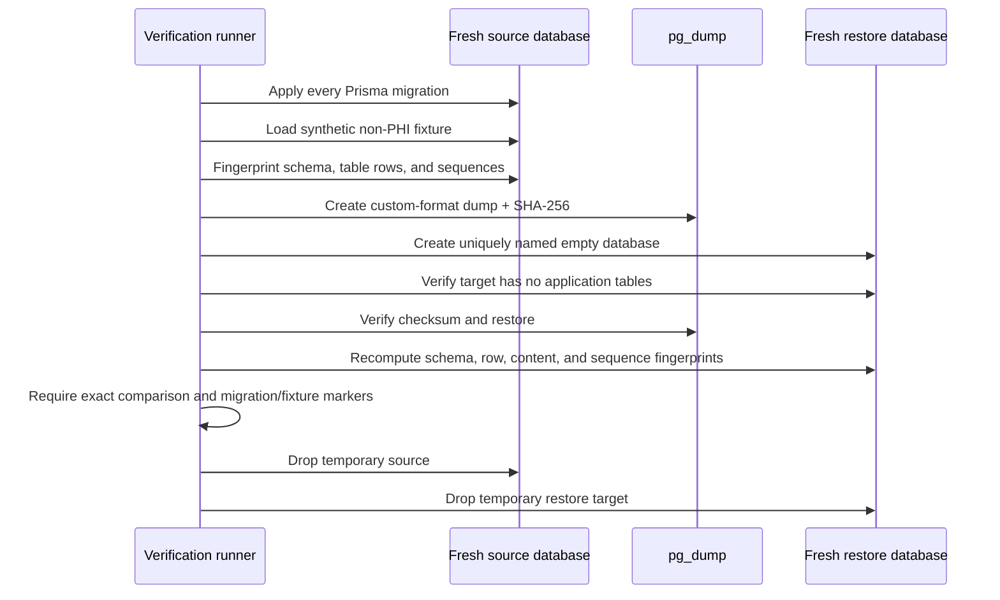
```mermaid
sequenceDiagram
    participant V as Verification runner
    participant S as Fresh source database
    participant D as pg_dump
    participant R as Fresh restore database

    V->>S: Apply every Prisma migration
    V->>S: Load synthetic non-PHI fixture
    V->>S: Fingerprint schema, table rows, and sequences
    V->>D: Create custom-format dump + SHA-256
    V->>R: Create uniquely named empty database
    V->>R: Verify target has no application tables
    V->>D: Verify checksum and restore
    V->>R: Recompute schema, row, content, and sequence fingerprints
    V->>V: Require exact comparison and migration/fixture markers
    V->>S: Drop temporary source
    V->>R: Drop temporary restore target
```

The concrete result, versions, hashes, safeguards, cleanup status, and
limitations are recorded in [Backup/restore evidence](backup-restore-evidence.md).
No real patient data is required for the drill.

### 8.4 Acceptance evidence

| Check               | Acceptance condition                                                     | Final evidence location                  |
| ------------------- | ------------------------------------------------------------------------ | ---------------------------------------- |
| Backend compile     | Nest TypeScript build exits zero                                         | final delivery command record            |
| Backend lint        | strict ESLint check exits zero                                           | final delivery command record            |
| Backend tests       | all discovered unit tests pass                                           | final delivery command record            |
| API/security tests  | all E2E suites pass including real throttling                            | final delivery command record            |
| Frontend lint/build | ESLint and production Vite build exit zero                               | final delivery command record            |
| Prisma              | schema validates and migrations apply to a fresh DB                      | backup/restore evidence                  |
| OpenAPI             | every route receives tag/auth metadata and documented DTO schemas/errors | API E2E assertions and live OpenAPI JSON |
| Dependency audit    | production dependency audit reports no known vulnerability               | final delivery command record            |
| Production config   | Compose interpolation and env validation pass                            | final delivery command record            |
| Restore             | exact fresh-target comparison passes and temporary DBs are dropped       | backup/restore evidence                  |

## 9. API documentation

The API is versioned under `/api/v1`. With documentation enabled, Swagger UI
is served at `/api/v1/docs` and OpenAPI JSON at
`/api/v1/docs/openapi.json`. Every operation is assigned a domain tag and the
correct bearer, refresh-cookie, or public security declaration. Request DTOs
document types, constraints, and examples; responses identify success and
standard validation/authentication/authorization/not-found/conflict/throttle
conditions. The narrative [API reference](api-reference.md) explains cross-cutting
conventions and role behavior that a schema alone cannot express.

Swagger can be disabled in a deployment through `SWAGGER_ENABLED=false`. It is
documentation, not an authorization layer; guards and service predicates
remain authoritative.

## 10. Production deployment and operations

The production topology has four operational phases/services: PostgreSQL,
one-shot Prisma migration, API, and NGINX-hosted SPA, plus a scheduled backup
worker. The database network is internal. API startup is gated by database
health and successful migration; web startup is gated by API health. NGINX
redirects port 80 to 443, accepts TLS 1.2/1.3, adds HSTS and browser hardening
headers, limits request bursts, and exposes only `/api` and static assets.

Deployment uses an untracked `.env.production`, mounted certificate chain and
private key, and reviewed immutable images. The environment preflight rejects
development URLs, short/placeholding secrets, insecure cookies, absent SMTP or
Web Push credentials, and mismatched production settings. Operators must
monitor database/API health, elevated `401`/`403`/`429`/`5xx` rates, provider
failures, audit pipeline errors, backup age, volume capacity, certificate
expiry, and migration failures.

The complete procedure, rollback boundaries, HTTPS checks, backup retention,
off-site requirement, and restore drill commands are in
[Production deployment](deployment.md). A local Compose parse validates
topology but cannot validate a real certificate, DNS, firewall, or public TLS
path; those checks occur on the target host.

## 11. User-interface evidence

The UI supplies role-aware routing and views for authentication, patient care,
doctor monitoring, administration, notifications, appointments, history,
goals, emergency mode, reports, exports, and security/session management.

These images were captured on 14 August 2026 from the real production frontend
build connected to the real API and a freshly migrated PostgreSQL database.
The isolated fixture contains synthetic `Example`/`Sample` identities and
`example.test` addresses only. The [screenshot evidence register](screenshots/README.md)
records the viewport, baseline, privacy inspection, captured alternatives, and
honestly pending optional views.

### 11.1 Authentication and patient workflow

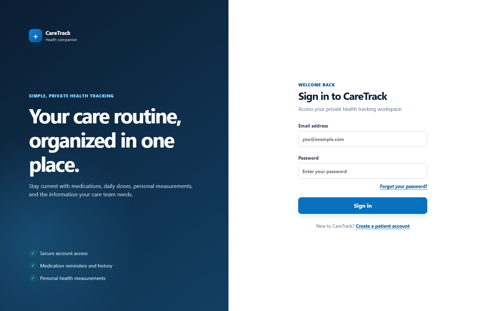

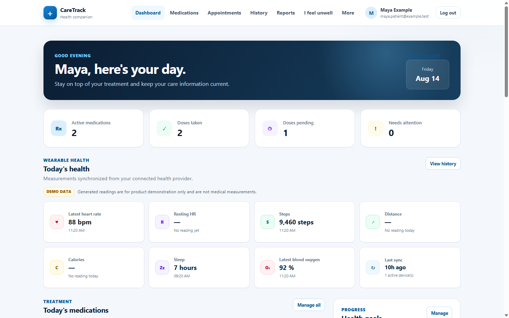

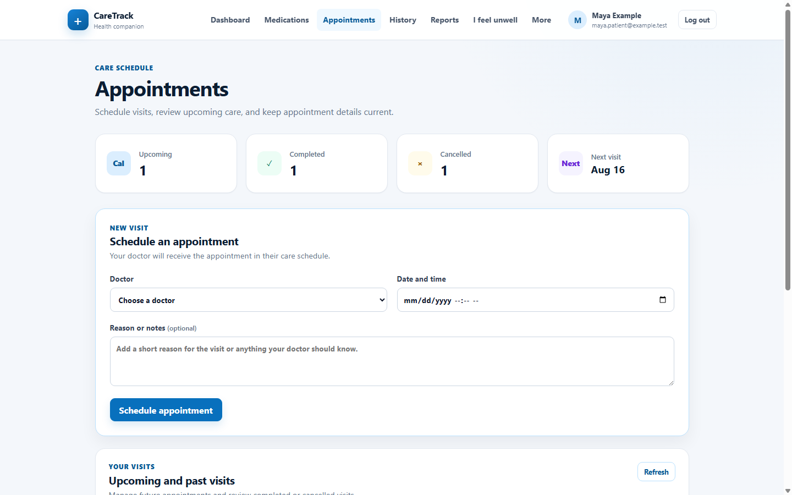

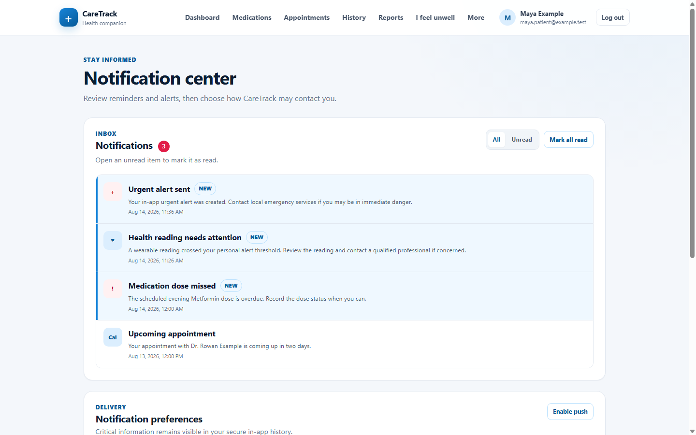

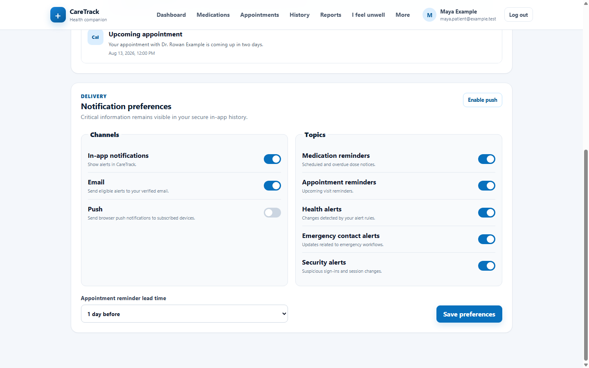

### 11.2 Longitudinal care, goals, emergency context, and reports

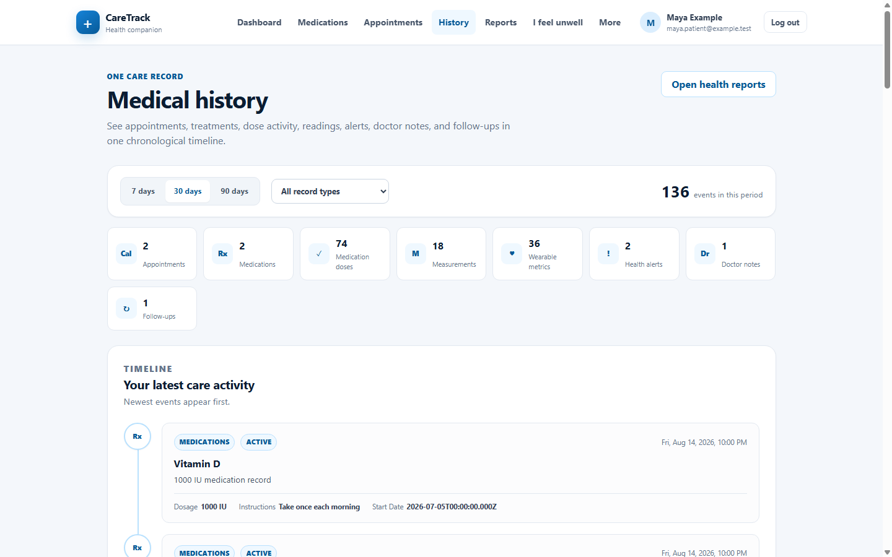

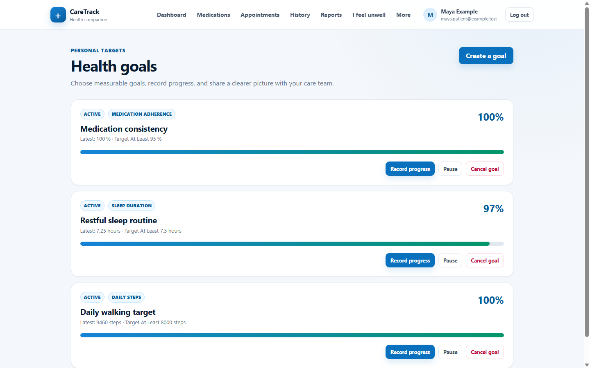

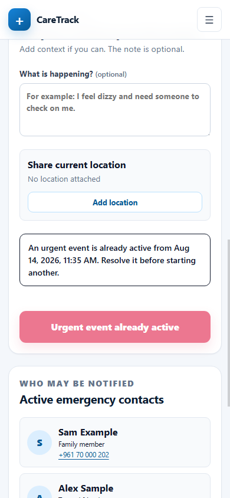

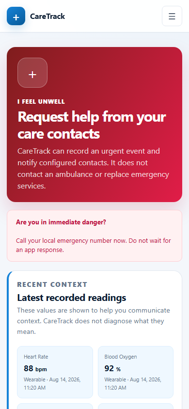

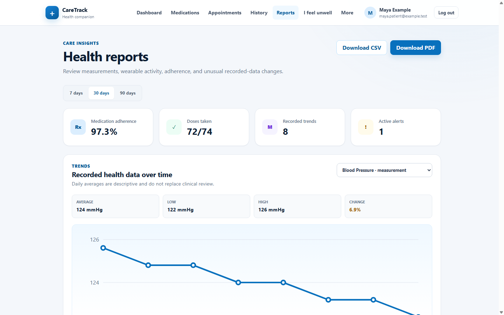

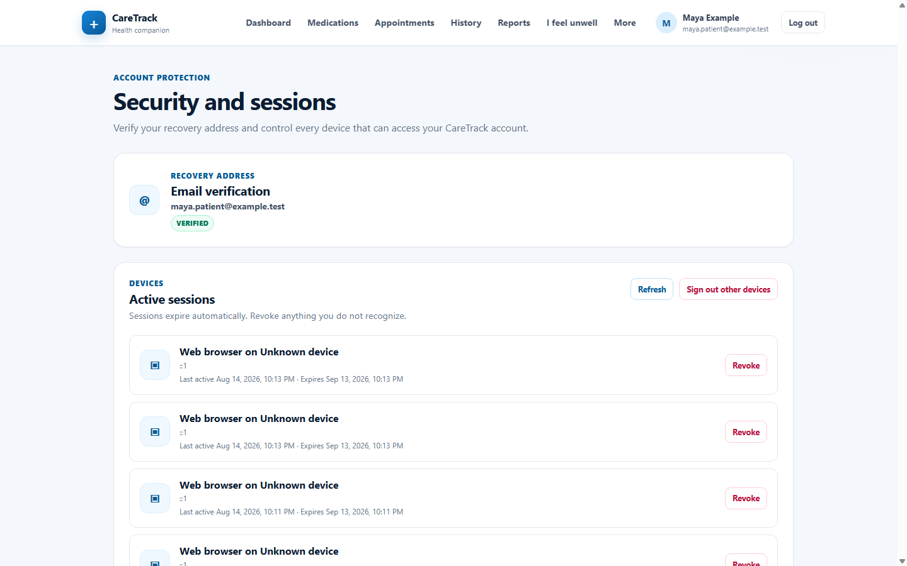

### 11.3 Doctor, administrator, and API views

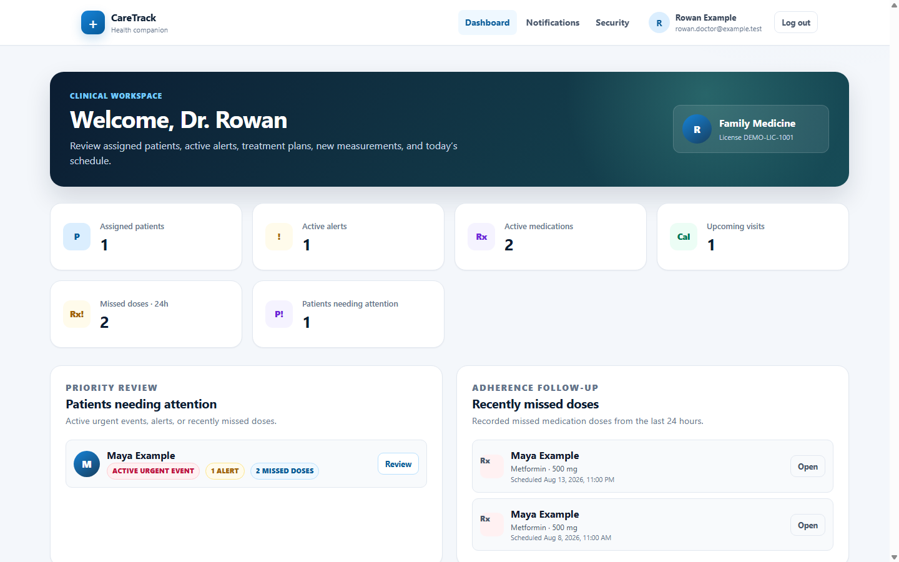

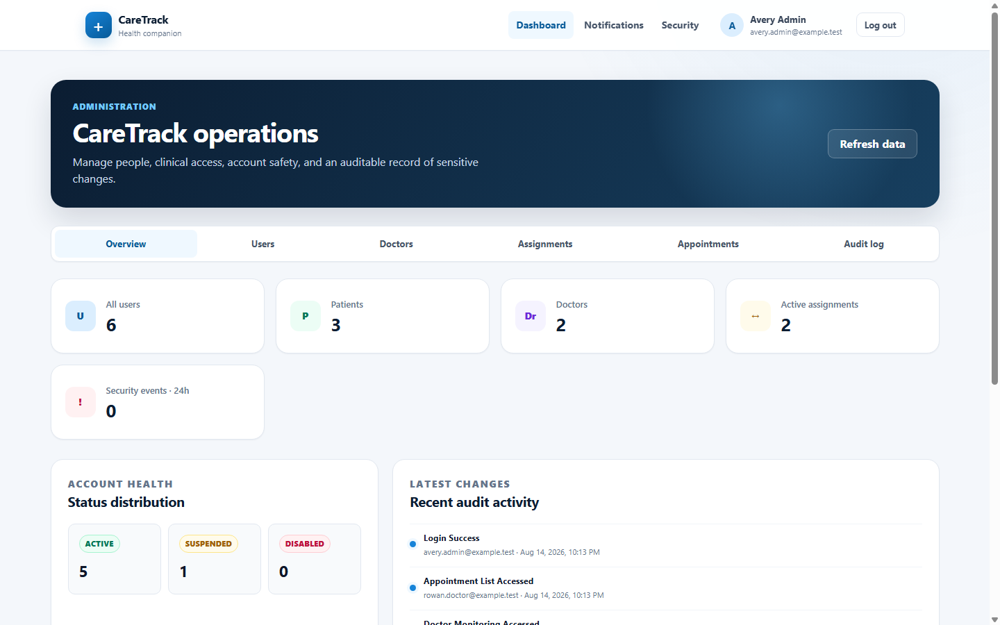

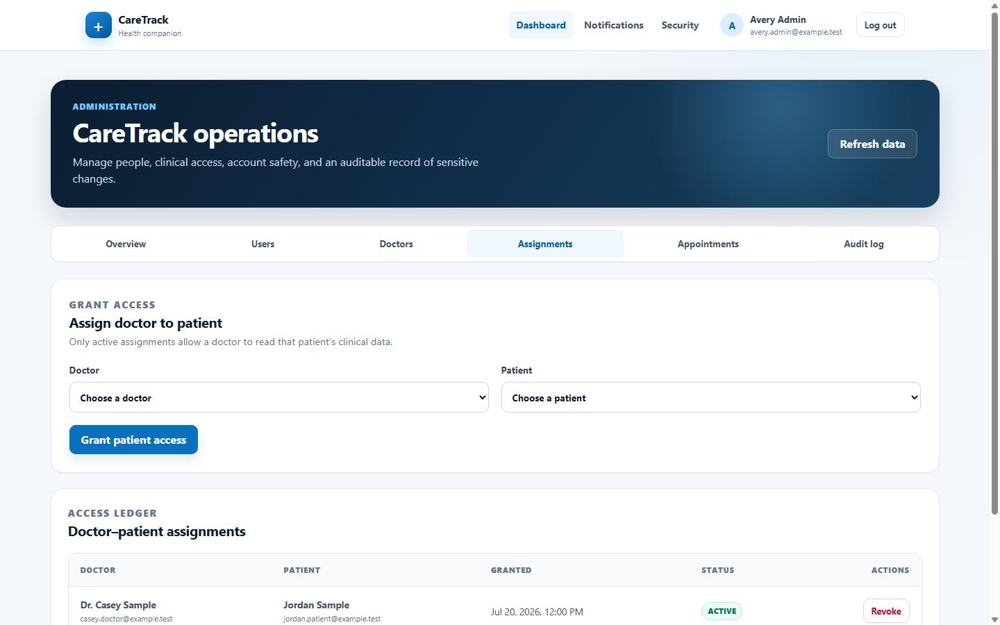

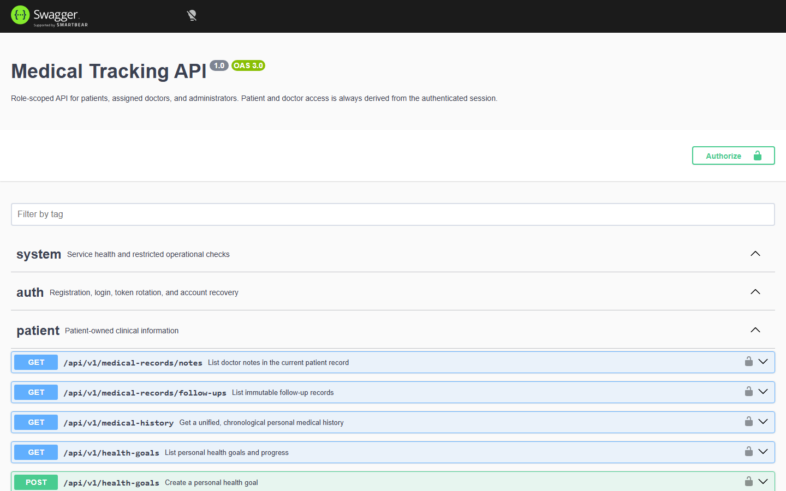

## 12. Limitations and future work

### 12.1 Current limitations

- This is an educational system and has not undergone medical-device
  certification, formal clinical validation, or jurisdiction-specific legal
  assessment.
- SMTP/Web Push delivery depends on external-provider availability; push is a
  best-effort channel and cannot replace emergency contact procedures.
- Most wearable providers are represented in the data model but require real
  OAuth/consent adapters and provider conformance tests.
- The supplied Compose deployment is a single-host baseline. It does not
  provide multi-region failover, database high availability, zero-downtime
  schema evolution, or centralized observability by itself.
- Local backups are not disaster recovery until encrypted, access-controlled,
  versioned off-site replication and restoration are operated and monitored.
- The automated restore drill verified PostgreSQL 17 on one local host; a
  cross-host/off-site recovery drill and measured RPO/RTO are still required.
- A deployed-host TLS scan and real provider delivery receipts require
  environment-specific infrastructure outside this source workspace. The
  captured UI evidence and optional pending views are listed separately in the
  screenshot register.

### 12.2 Prioritized future work

1. Add phishing-resistant MFA/passkeys and step-up authentication for admin
   and high-risk clinical actions.
2. Add provider-specific wearable consent, token rotation, revocation, and
   provenance displays.
3. Add encrypted object-storage backup replication, restore automation,
   recovery-time measurement, and disaster-recovery exercises.
4. Add centralized metrics/traces, correlation IDs, tamper-resistant audit-log
   export, and security alert dashboards.
5. Add accessibility testing (WCAG), browser/device matrices, performance/load
   tests, and representative clinician/patient usability evaluation.
6. Add formal data retention/deletion workflows, consent records, and
   jurisdiction-specific compliance evidence.
7. Add independent penetration testing, software bill-of-materials generation,
   signed images, and continuous dependency/container scanning.

## 13. Conclusion

CareTrack demonstrates that a useful medical tracking workflow and strict
least-privilege access can be designed together. The most important property
is not the number of screens or endpoints; it is the repeated authorization
invariant: session identity is validated against current database state, a
patient owns the requested object, or a doctor has an active assignment.
Operational safeguards—validated input, deduplicated scheduled work, audit
records, environment-only secrets, HTTPS, migration gates, and verified
backups—extend that invariant beyond individual controller methods.

The remaining limitations are explicit rather than hidden. With the listed
deployment-specific verification, independent assessment, compliance work,
and operational maturity, this implementation provides a defensible foundation
for further development.

## References and repository evidence

- [API reference](api-reference.md)
- [Architecture and supplementary diagrams](architecture.md)
- [Security model and verification](security.md)
- [Production deployment and backup operations](deployment.md)
- [Backup/restore evidence](backup-restore-evidence.md)
- [Patient API contract](api-contract.md)
- [Project boundary and ownership contract](project-contract.md)
- [Wearable-health integration boundary](wearable-health.md)
- [Screenshot register](screenshots/README.md)
- OWASP, _Application Security Verification Standard_ and _API Security Top 10_
- IETF RFC 7519, _JSON Web Token (JWT)_
- OpenAPI Initiative, _OpenAPI Specification 3.0_
- PostgreSQL documentation, _Backup and Restore_
